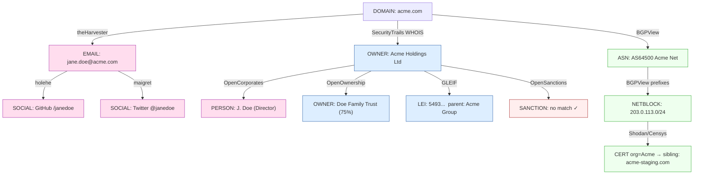

# OSINT — PEOPLE & CORPORATE INTELLIGENCE

Open-source intelligence on **humans and organizations** using only free / open-source tooling.
This skill answers *"who and what is behind this entity, and how is it connected?"* — it does
**not** map a single domain's attack surface (that is `web2-recon`).

---

## OSINT vs RECON — DO NOT CONFUSE THEM

| | `web2-recon` | `osint` (this skill) |
|---|---|---|
| **Question** | "What is the attack surface of `target.com`?" | "Who/what is behind this entity and how is it connected?" |
| **Subjects** | One domain's hosts, URLs, params, ports | People, companies, owners, ASNs, brands, emails, usernames |
| **Examples** | subfinder, httpx, katana, nuclei, naabu, ffuf, gau | theHarvester, SpiderFoot, OpenCorporates, OpenSanctions, maigret, Shodan |
| **Output** | Live hosts + classified URL list | Entity-relationship graph + intel dossier |

**Hard rule:** never run subdomain enumeration, live-host probing, URL crawling, directory
fuzzing, or nuclei from this skill. Those belong to `web2-recon`. If you need them, hand off.
**No tool used by web2-recon is reused here.**

---

## WHEN TO USE

- Attribution: "who owns/operates this infrastructure, brand, or wallet-adjacent identity?"
- Phishing-surface mapping: employees, emails, and naming convention of a target org
- Executive / personnel enumeration for a bug bounty program's parent company
- Third-party / vendor / supply-chain due diligence
- Company ownership tracing (parent → subsidiary → beneficial owner)
- Sanctions / PEP screening of a counterparty (Web3 KYC, exchange listings)
- Breach-exposure check on an in-scope email or account
- Building the "Reporter background / context" section of a report

---

## SETUP — API KEYS

> **Key reference file:** `skills/osint/API_KEYS.md` holds a fill-in table of every keyed
> source. Check it at the start of every run to see which keys the user has provided, then
> export the matching env vars. Skip any source left blank.

Everything below has a **free tier or is fully free**. Nothing here is required to start —
the engine degrades gracefully and skips any source whose key is missing. Set what you have:

```bash
# ── No key required (work out of the box) ───────────────────────────────────
#   BGPView, GLEIF, OpenOwnership (bulk), DNSDumpster (HackerTarget free),
#   sherlock, maigret, holehe, socialscan, PhoneInfoga, theHarvester (core),
#   recon-ng (core), SpiderFoot (core), exiftool, Google dorking, OSINT Framework

# ── Free-tier keys (recommended — big coverage boost) ───────────────────────
export SHODAN_API_KEY=""           # account free, limited credits — internet asset intel
export CENSYS_API_ID=""            # free tier — host/cert intel
export CENSYS_API_SECRET=""
export SECURITYTRAILS_API_KEY=""   # free 50 queries/mo — DNS + WHOIS history
export BUILTWITH_API_KEY=""        # free tier — tech-stack profiling (or use free web lookup)
export IPINFO_TOKEN=""             # free 50k/mo — ASN/geo/org enrichment
export HUNTER_API_KEY=""           # free 25/mo — email pattern + verification
export GITHUB_TOKEN=""             # free — powers recon-ng/theHarvester GitHub modules
export OPENCORPORATES_API_KEY=""   # free for journalists/researchers (apply) — company registry
export OPENSANCTIONS_API_KEY=""    # hosted API key, OR self-host `yente` free (no key)

# Persist:  echo 'export SHODAN_API_KEY="..."' >> ~/.zshrc
```

> **What to ask the user for:** Shodan, Censys, SecurityTrails, and a GitHub token give the
> biggest jump in coverage for the least effort. OpenCorporates + OpenSanctions matter only
> for the *corporate* track. Everything else is free without a key. See the **API KEY
> CHECKLIST** at the bottom for the exact "need / nice-to-have / free" breakdown to surface.

```bash
# Verify tooling is installed (engine auto-skips whatever is missing):
which theHarvester spiderfoot recon-ng maigret sherlock holehe socialscan \
      phoneinfoga exiftool shodan jq curl 2>/dev/null
# or: ./tools/external_arsenal.sh | grep osint
```

### Install notes (Python 3.14 toolchain quirks)

Most people-track tools install cleanly with `pipx`. Two gotchas seen on Python 3.14:

- **`shodan` CLI** imports the removed `pkg_resources`. Fix once after install:
  `pipx inject shodan "setuptools<81"` (re-adds the shim). Or install it under an older
  interpreter: `pipx install --python "$(brew --prefix python@3.10)/bin/python3.10" shodan`.
- **`spiderfoot`** is *not* on PyPI as `spiderfoot` — install via git clone + venv (its
  `requirements.txt` pins an lxml that won't build on 3.14, so relax that one pin):
  ```bash
  git clone https://github.com/smicallef/spiderfoot ~/tools/spiderfoot
  cd ~/tools/spiderfoot && python3 -m venv .venv && . .venv/bin/activate
  sed -E 's/^lxml.*/lxml>=5/' requirements.txt > /tmp/sf_reqs.txt && pip install -r /tmp/sf_reqs.txt
  # add a launcher so `spiderfoot` is on PATH:
  printf '#!/bin/bash\nexec "$HOME/tools/spiderfoot/.venv/bin/python" "$HOME/tools/spiderfoot/sf.py" "$@"\n' \
    > ~/.local/bin/spiderfoot && chmod +x ~/.local/bin/spiderfoot
  ```

General rule: if a `pipx` tool fails on the newest Python, reinstall it under 3.10/3.12
(`pipx install --python <py310> <tool>`) — that resolves most C-extension/`pkg_resources` breaks.

---

## OPSEC & LEGALITY — READ BEFORE RUNNING

OSINT touches **real people**. Treat it with more care than infrastructure scanning.

1. **Passive only by default.** Every source here queries third-party databases, *not* the
   subject. Do not pivot OSINT findings into authentication attempts, social engineering,
   or contacting individuals unless the program scope explicitly authorizes it.
2. **Stay in scope.** Personnel/PII enumeration is *out of scope* on many bug bounty
   programs. Confirm the policy allows it before profiling employees.
3. **Breach data:** use exposure **counts and source names** for risk signal — do not
   collect, store, or paste plaintext credentials into a report.
4. **Minimize + purge.** Keep only what supports the finding. Don't hoard dossiers on people.
5. **Attribution ≠ accusation.** Report "associated with" / "registered to," never
   "is guilty of." Corroborate from ≥2 independent sources before asserting a link.
6. **Sanctions/PEP hits are leads, not verdicts** — name collisions are common; verify DOB,
   jurisdiction, and identifiers before reporting a match.

---

## THE MALTEGO MODEL — ENTITIES, TRANSFORMS, GRAPH

This skill mimics Maltego's mental model without the GUI. You maintain a working **graph**:
**entities** (typed nodes) connected by **transforms** (a source that turns one entity into
related entities). Pivot breadth-first, dedupe, and render the result as a Mermaid graph.

### Entity types

`PERSON` · `EMAIL` · `USERNAME` · `PHONE` · `ORG/COMPANY` · `DOMAIN` · `IP` · `ASN` ·
`NETBLOCK` · `CERT` · `SOCIAL_PROFILE` · `DOCUMENT` · `BREACH` · `LEI` · `OWNER` ·
`SANCTION_ENTITY` · `WALLET/ADDRESS`

### Transform catalog (entity → transform → output)

| From entity | Transform (source) | To entity | Key? |
|---|---|---|---|
| DOMAIN | theHarvester (emails/names/hosts from search engines) | EMAIL, PERSON | free* |
| DOMAIN | Hunter.io (email pattern + people) | EMAIL, PERSON | free-tier |
| DOMAIN | SecurityTrails (WHOIS + DNS history) | OWNER, EMAIL, IP | free-tier |
| DOMAIN | BuiltWith (tech profile + relationships) | ORG, DOMAIN | free-tier |
| DOMAIN | DNSDumpster / HackerTarget | IP, NETBLOCK | free |
| EMAIL | holehe (which sites that email is registered on) | SOCIAL_PROFILE | free |
| EMAIL | socialscan (account/username availability) | SOCIAL_PROFILE | free |
| EMAIL | breach lookup (count + source only) | BREACH | varies |
| EMAIL | GHunt (Google account → name, photo, reviews) | PERSON, SOCIAL_PROFILE | free** |
| USERNAME | maigret (3000+ sites) | SOCIAL_PROFILE, PERSON | free |
| USERNAME | sherlock (400+ sites) | SOCIAL_PROFILE | free |
| PERSON | CrossLinked / LinkedIn pattern → corp email format | EMAIL | free |
| PHONE | PhoneInfoga (carrier, region, footprint) | ORG, SOCIAL_PROFILE | free |
| ORG/COMPANY | OpenCorporates (registry: officers, filings, status) | OWNER, PERSON, ORG | free-tier |
| ORG/COMPANY | OpenOwnership (beneficial ownership graph) | OWNER, PERSON | free |
| ORG/COMPANY | GLEIF (LEI → legal name, parent/child) | LEI, ORG | free |
| PERSON/ORG | OpenSanctions / yente (sanctions, PEP, watchlists) | SANCTION_ENTITY | free** |
| DOMAIN/IP | BGPView (ASN, prefix, org owner, peers) | ASN, NETBLOCK, ORG | free |
| IP | Shodan / Censys (host intel, certs, orgs) | ORG, CERT, DOMAIN | free-tier |
| IP | ipinfo (ASN/org/geo) | ORG, ASN | free-tier |
| CERT | Censys cert search (SAN → siblings) | DOMAIN, ORG | free-tier |
| any | SpiderFoot (200+ module aggregator) | * | free*** |
| any | recon-ng (modular marketplace) | * | free*** |
| DOCUMENT | exiftool (author, software, GPS, timestamps) | PERSON, USERNAME | free |
| any | Google dorking | DOCUMENT, EMAIL, SOCIAL_PROFILE | free |

\* theHarvester core is free; some engines want keys.  ** GHunt needs a Google cookie; OpenSanctions self-host `yente` is free.  *** core free, individual modules may want API keys.

### Pivot discipline (so the graph stays finite)

- **Breadth-first, depth ≤ 3** from the seed unless something is high-value.
- **Dedupe** every new entity against the graph before transforming it again.
- **Stop a branch** when it only yields generic infra (CDN IPs, shared hosting, parked domains).
- **5-minute rule (OSINT variant):** if a seed produces no person, no org link, and no
  unique infra after ~5 min of pivoting, mark it cold and move on.

---

## TRACK A — PEOPLE OSINT

Goal: from a seed (name, email, username, or phone) build a person profile and their
account footprint. **Use exposure as risk signal; never collect credentials.**

```bash
SEED_EMAIL="jane.doe@target.com"
SEED_USER="janedoe"
OUT="osint/people/$(echo "$SEED_USER" | tr -cd 'a-z0-9')"
mkdir -p "$OUT"

# 1) Email → where is it registered?  (holehe = no key, passive)
holehe "$SEED_EMAIL" --only-used > "$OUT/holehe.txt" 2>/dev/null

# 2) Email/username availability across networks (socialscan = no key)
socialscan "$SEED_EMAIL" "$SEED_USER" > "$OUT/socialscan.txt" 2>/dev/null

# 3) Username → social profiles across thousands of sites (maigret = no key)
maigret "$SEED_USER" --no-progressbar --timeout 10 -T \
        --folderpath "$OUT/maigret" 2>/dev/null

# 4) Username → 400+ sites (sherlock = no key) — good cross-check vs maigret
sherlock "$SEED_USER" --timeout 10 --print-found \
         --folderpath "$OUT" 2>/dev/null

# 5) Google account intel from an email (GHunt — needs a Google cookie file once)
#    ghunt email "$SEED_EMAIL"   # → display name, profile photo, maps reviews, calendar

# 6) Breach EXPOSURE signal — count + source names only, never plaintext
#    Prefer HIBP if the user has a key; otherwise document the check was run.
#    curl -s -H "hibp-api-key: $HIBP_API_KEY" \
#      "https://haveibeenpwned.com/api/v3/breachedaccount/$SEED_EMAIL?truncateResponse=false" \
#      | jq -r '.[].Name'   # report breach NAMES + counts only

# 7) Corp email-format inference from a name (no creds, just the pattern)
#    CrossLinked scrapes public LinkedIn → builds first.last@domain style guesses
#    crosslinked -f '{first}.{last}@target.com' "Target Company" -o "$OUT/email_format.txt"
```

**People output:** account footprint (which platforms), likely real name, breach exposure
*signal*, and corp email naming convention — all feeding `SOCIAL_PROFILE`/`PERSON`/`EMAIL`
nodes in the graph.

---

## TRACK B — CORPORATE OSINT

Goal: from an org/brand/domain, establish legal identity, ownership chain, sanctions status,
and the network/tech footprint it controls.

```bash
COMPANY="Acme Holdings Ltd"
JURIS="gb"                      # ISO country for registry scoping
DOMAIN="acme.com"
OUT="osint/corp/$(echo "$DOMAIN" | tr -cd 'a-z0-9.')"
mkdir -p "$OUT"

# 1) Company registry — officers, status, filings  (OpenCorporates, free-tier key)
curl -s "https://api.opencorporates.com/v0.4/companies/search?q=$(printf %s "$COMPANY" | jq -sRr @uri)&jurisdiction_code=$JURIS${OPENCORPORATES_API_KEY:+&api_token=$OPENCORPORATES_API_KEY}" \
  | jq -r '.results.companies[].company | "\(.name) | \(.company_number) | \(.jurisdiction_code) | \(.current_status)"' \
  | tee "$OUT/opencorporates.txt"

# 2) Beneficial ownership graph  (OpenOwnership Register, free)
curl -s "https://register.openownership.org/search.json?q=$(printf %s "$COMPANY" | jq -sRr @uri)" \
  | jq -r '.[]?' 2>/dev/null | tee "$OUT/openownership.json" >/dev/null
#   Or download the bulk Beneficial Ownership Data Standard (BODS) statements — fully free.

# 3) Legal Entity Identifier → legal name + parent/child relationships  (GLEIF, free, no key)
curl -s "https://api.gleif.org/api/v1/lei-records?filter[entity.legalName]=$(printf %s "$COMPANY" | jq -sRr @uri)&page[size]=5" \
  | jq -r '.data[] | "\(.attributes.lei) | \(.attributes.entity.legalName.name) | \(.attributes.entity.legalAddress.country)"' \
  | tee "$OUT/gleif.txt"

# 4) Sanctions / PEP / watchlist screening  (OpenSanctions hosted, or self-host `yente` free)
curl -s "https://api.opensanctions.org/search/default?q=$(printf %s "$COMPANY" | jq -sRr @uri)" \
     ${OPENSANCTIONS_API_KEY:+-H "Authorization: ApiKey $OPENSANCTIONS_API_KEY"} \
  | jq -r '.results[] | "\(.caption) | \(.schema) | datasets=\(.datasets|join(","))"' \
  | tee "$OUT/opensanctions.txt"
# Self-host (no key, no rate limit): docker run -p 8000:8000 ghcr.io/opensanctions/yente

# 5) ASN / netblock ownership for the org's infrastructure  (BGPView, free, no key)
curl -s "https://api.bgpview.io/search?query_term=$(printf %s "$COMPANY" | jq -sRr @uri)" \
  | jq -r '.data.asns[]? | "AS\(.asn) | \(.name) | \(.description)"' \
  | tee "$OUT/bgpview_asns.txt"
# Then expand each ASN → prefixes it announces:
#   curl -s "https://api.bgpview.io/asn/AS12345/prefixes" | jq -r '.data.ipv4_prefixes[].prefix'

# 6) Tech footprint of the brand  (BuiltWith — free web lookup, key for API/relationships)
#    https://builtwith.com/$DOMAIN   (relationships tab links sibling sites by analytics IDs)
#    curl -s "https://api.builtwith.com/v21/api.json?KEY=$BUILTWITH_API_KEY&LOOKUP=$DOMAIN"

# 7) DNS + WHOIS history → past owners, hidden registrant emails  (SecurityTrails, free-tier)
curl -s -H "APIKEY: $SECURITYTRAILS_API_KEY" \
     "https://api.securitytrails.com/v1/domain/$DOMAIN/whois" \
  | jq '.' | tee "$OUT/securitytrails_whois.json" >/dev/null
```

**Corporate output:** legal name + registry number, parent/subsidiary chain, beneficial
owners, sanctions/PEP status, owned ASNs/netblocks, and brand tech footprint — feeding
`ORG`/`OWNER`/`LEI`/`SANCTION_ENTITY`/`ASN` nodes.

---

## INFRASTRUCTURE INTEL (ownership, not attack-surface)

This is the OSINT *ownership* angle on infrastructure — **who runs it**, not what's exploitable
on it. (Exploit-surface mapping stays in `web2-recon`.)

```bash
IP="203.0.113.10"

# Shodan host intel — open services as INTEL, org, hostnames, certs  (free-tier key)
shodan host "$IP" 2>/dev/null | tee "osint/infra/$IP.shodan.txt"
#   Or keyless InternetDB (no key, passive): https://internetdb.shodan.io/$IP
curl -s "https://internetdb.shodan.io/$IP" | jq '.'

# Censys host + cert pivots — SAN names reveal sibling domains  (free-tier key)
#   censys view "$IP"           # host detail
#   censys search "services.tls.certificates.leaf_data.subject.organization: \"Acme\""

# ipinfo — ASN, org, geo  (free-tier token)
curl -s "https://ipinfo.io/$IP/json${IPINFO_TOKEN:+?token=$IPINFO_TOKEN}" | jq '.'

# BGPView — IP → prefix → ASN → org owner, and peers
curl -s "https://api.bgpview.io/ip/$IP" \
  | jq -r '.data.prefixes[]? | "\(.prefix) | AS\(.asn.asn) \(.asn.name) | \(.asn.description)"'
```

---

## AGGREGATORS — SPIDERFOOT & RECON-NG

When you want one tool to fan out across many transforms automatically, drive an aggregator.
These overlap many single-purpose tools above; use them for **breadth**, then verify hits
with the targeted tool.

### SpiderFoot (200+ modules — closest free Maltego analogue)

```bash
# Headless scan via CLI (passive modules only = safe, no target contact)
spiderfoot -s "$SEED" -t EMAILADDR,DOMAIN_NAME,HUMAN_NAME,COMPANY_NAME \
           -m sfp_dnsresolve,sfp_whois,sfp_hunter,sfp_shodan,sfp_bgpview,sfp_opencorporates \
           -o csv > "osint/spiderfoot_$SEED.csv" 2>/dev/null

# Or run the web UI for the interactive graph (its built-in correlation view):
#   spiderfoot -l 127.0.0.1:5001   → open http://127.0.0.1:5001
# Set module API keys in Settings (Shodan, Hunter, SecurityTrails, etc.) — all optional.
```

### recon-ng (modular marketplace, recon-ng ≈ scripted Maltego)

```bash
# Non-interactive resource script
cat > /tmp/recon.rc <<'RC'
marketplace install all
keys add shodan_api <SHODAN_API_KEY>
keys add github_api <GITHUB_TOKEN>
workspaces create target
modules load recon/domains-hosts/hackertarget
options set SOURCE target.com
run
modules load recon/companies-multi/whois_miner
run
modules load recon/profiles-profiles/profiler
run
RC
recon-ng -r /tmp/recon.rc
# Export the workspace to feed the graph:  modules load reporting/csv; run
```

---

## DOCUMENT METADATA & GOOGLE DORKING

```bash
# Pull public docs, then strip metadata for authorship/software/GPS leaks
exiftool -Author -Creator -Producer -Software -GPSLatitude -GPSLongitude \
         -CreateDate -ModifyDate ./downloads/*.pdf ./downloads/*.docx ./downloads/*.jpg

# Google dorks (run manually in a browser — do not automate scraping aggressively)
#   site:target.com filetype:pdf                  → leaked internal docs
#   site:target.com (employee | staff | "@target.com")
#   intext:"@target.com" filetype:xlsx            → contact spreadsheets
#   site:linkedin.com/in "Target Company"         → employee enumeration
#   site:github.com "target.com"                  → repos referencing the org
#   "target.com" site:pastebin.com                → leaked pastes
#   site:trello.com OR site:s3.amazonaws.com "Target Company"
```

For curated dork lists and the full source map, see the **OSINT Framework**
(https://osintframework.com) and `skills/security-arsenal/REFERENCES.md`.

---

## ENTITY-RELATIONSHIP GRAPH (Mermaid — Maltego-style output)

Render the working graph as Mermaid so it shows inline in the report/terminal. Group by
entity type, label edges with the transform that produced them.



**Build rules:** one node per unique entity (dedupe!), edge label = the transform/source,
color by class, flag risk nodes (sanctions/breach) in red. Keep it to the entities that
actually support a conclusion — prune dead infra branches.

---

## REPORT — VERSIONED OSINT DOSSIER

Write a numbered, versioned dossier to the assessment directory (same convention as
`burp-analysis` / `red-team-llm`).

- No prior report → `{Subject}_OSINT_Dossier.md`
- One exists → `{Subject}_OSINT_Dossier_2.md` (include a **delta vs prior** section)

### Dossier template

```markdown
# OSINT Dossier — {Subject}
**Date:** {date}  ·  **Track:** People | Corporate | Both  ·  **Analyst:** {user}
**Seed(s):** {email/username/company/domain}

## 1. Executive Summary
- What the subject is, top 3 findings, confidence per finding (High/Med/Low + # sources)

## 2. Entity Graph
[Mermaid graph from the section above]

## 3. People Findings
| Entity | Type | Source(s) | Detail | Confidence |
|---|---|---|---|---|
(account footprint, real-name links, breach EXPOSURE signal — no credentials)

## 4. Corporate Findings
| Entity | Registry/Source | Number/LEI | Status | Detail |
|---|---|---|---|---|
(legal identity, ownership chain, beneficial owners, sanctions/PEP, owned ASNs)

## 5. Infrastructure Ownership
| IP/ASN/Netblock | Owner Org | Source | Note |
|---|---|---|---|
(BGPView / Shodan / Censys / ipinfo — ownership, NOT exploit surface)

## 6. Sanctions / PEP Screening
| Name searched | Match? | List/Dataset | Verifier (DOB/juris/id) |
|---|---|---|---|

## 7. Source Log & Reproducibility
| Transform | Tool | Key used? | Timestamp | Result file |
|---|---|---|---|---|

## 8. OPSEC / Handling Notes
- PII minimized? credentials excluded? in-scope confirmed?

## 9. Recommended Pivots / Next Steps
- Cold branches, unverified links worth a second source, handoff-to-recon items
```

---

## API KEY CHECKLIST — SURFACE THIS TO THE USER

When the user asks "what keys do you need?", present this:

| Tool / Source | Key env var | Cost | Track | Priority |
|---|---|---|---|---|
| Shodan | `SHODAN_API_KEY` | Free account (limited) | Infra | **High** |
| Censys | `CENSYS_API_ID` / `CENSYS_API_SECRET` | Free tier | Infra | **High** |
| SecurityTrails | `SECURITYTRAILS_API_KEY` | Free 50/mo | Infra/Corp | **High** |
| GitHub | `GITHUB_TOKEN` | Free | Both (recon-ng/theHarvester) | **High** |
| OpenCorporates | `OPENCORPORATES_API_KEY` | Free for researchers (apply) | Corp | Med |
| OpenSanctions | `OPENSANCTIONS_API_KEY` | Hosted key, or self-host `yente` free | Corp | Med |
| BuiltWith | `BUILTWITH_API_KEY` | Free tier (web lookup keyless) | Corp | Med |
| ipinfo | `IPINFO_TOKEN` | Free 50k/mo | Infra | Med |
| Hunter.io | `HUNTER_API_KEY` | Free 25/mo | People | Med |
| HaveIBeenPwned | `HIBP_API_KEY` | Paid (~$ small) | People | Optional |
| **No key needed** | — | Free | — | BGPView · GLEIF · OpenOwnership · DNSDumpster · maigret · sherlock · holehe · socialscan · PhoneInfoga · theHarvester(core) · recon-ng(core) · SpiderFoot(core) · exiftool · Shodan InternetDB |

> Minimum viable: **none** (free tools cover both tracks). Best ROI to ask for:
> **Shodan + Censys + SecurityTrails + GitHub token**. Add **OpenCorporates + OpenSanctions**
> only when the corporate/ownership/sanctions track is in play.

---

## QUICK ROUTING

| You have… | Start with | Then pivot to |
|---|---|---|
| An email | holehe → socialscan → GHunt | maigret on derived username, breach signal |
| A username | maigret + sherlock | holehe on derived emails, profile scrape |
| A company name | OpenCorporates → GLEIF → OpenOwnership | OpenSanctions, BGPView for its ASNs |
| A domain (ownership) | SecurityTrails WHOIS → BGPView | BuiltWith relationships, Censys certs |
| An IP / ASN | BGPView → ipinfo → Shodan/Censys | reverse to org → OpenCorporates |
| A phone number | PhoneInfoga | socialscan/maigret on derived handle |
| A document | exiftool | author → maigret, dorking |
| "Just go wide" | SpiderFoot (passive modules) or recon-ng | verify each hit with its targeted tool |
